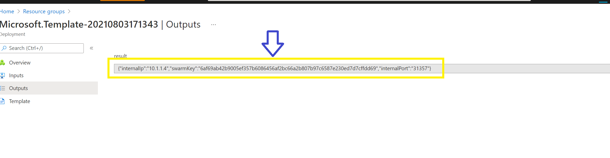

# IPFS on AKS

[](https://portal.azure.com/#create/Microsoft.Template/uri/https%3A%2F%2Fraw.githubusercontent.com%2Fcaleteeter%2Fipfs-aks%2Fmain%2FazureDeploy.json) [](http://armviz.io/#/?load=https%3A%2F%2Fraw.githubusercontent.com%2Fcaleteeter%2Fipfs-aks%2Fmain%2FazureDeploy.json)

This template deploys an AKS (Azure Kubernetes Service), a storage account, and a managed identity that will be used for data plane operations with the workload. This template can deploy either a single isolated private IPFS network or it can be used to join an existing network.

## Create a new network

To create a private IPFS network simply click the button above to deploy to Azure, which will prompt for a few parameters:

- Location - This is the Azure region to deploy the IPFS network infrastructure assets to. By default this will deploy to the same region/location as the resource group containing the deployment.

- Member Id - This is the parameter to specify the member identifier which must be unique to each member. The first member of the network being 1 and increments from there.

- Swarm Key Value - This is the unique key used to join the IPFS network.

## Joining an existing network

To join an existing network requires 2 items that will need to be retrieved from a current member of the network.

- Swarm Key - used to establish a root for the IPFS network

- Vnet peer connection - The underlying physical network connection to allow private communication between members.

When provisioning the new network, an output variable is created that contains the information needed to join the network.



This will provide the swarm key and the port number that the service is listening on. Next, the vnets will need to be peered. Details on how to do that are [here](https://docs.microsoft.com/en-us/azure/virtual-network/virtual-network-manage-peering#create-a-peering).

After successfully peering the network, IPFS will need to be updated to use the node from the existing network to bootstrap. The template will handle wiring up the swarm key, and this is the last step to joining.

1. Create access to the service on AKS. This can be done via a simple VM that is peered to the network.

2. After getting access run the following command to get the id from the existing node:

   ```
   curl -X POST http://<internal ip from output parameter above>:<port that mapps to 5001 for the service>/api/v0/id
   ```

3. Now copy the identifier and run the following command:

   ```
   curl -X POST http://<internal ip from the joining service>:<port in the output parameter of the joining service>/api/v0/bootstrap/add?arg=<id from step above>
   ```
